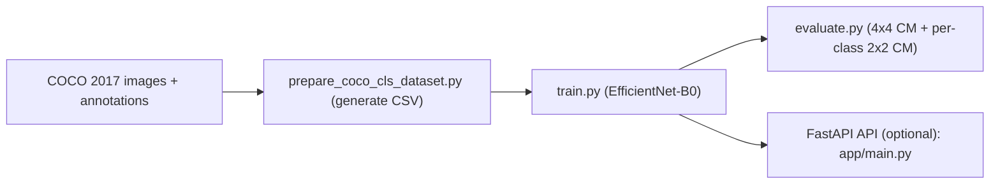

# COCO-4CLS (MS COCO 2017 4-class Image Classification)

本專案以 **MS COCO 2017** 為資料來源，建立「**四分類影像分類（classification）**」模型（**不是 object detection**）。  
做法：將 COCO 的 detection annotations 轉成 **single-label** 的 4-class classification dataset（使用 CSV manifests 管理），再使用 CNN backbone 訓練分類器，最後輸出整體與每類的 confusion matrix 與 accuracy。

> 本專案為 image-level classification：不輸出 bbox、不做 NMS、不包含 detection head。

---

## 題目要求對應 (Deliverables)

1. ✅ 完整專案代碼（已上傳 GitHub；COCO 原始資料與模型權重不放入 repo）
2. ✅ README.md（包含：專案介紹 / 技術棧 / 本地運行步驟 / Docker 部署指令 / API 文件連結 / 測試帳號資訊）
3. ✅ `.env.example`
4. ✅ 至少一份測試 CSV：`data/sample_inference.csv`
5. ✅ 系統架構圖：README 內 Mermaid + 評估輸出（`docs/`）

---

## 選擇的 4 類別 (Ground Truth Classes)

預設使用 COCO categories：
- `cat`
- `dog`
- `car`
- `bicycle`

可於 `.env` 修改 `CATEGORIES=...` 替換為其他 4 類（需為 COCO 合法 category name）。

---

## 技術棧 (Tech Stack)

- Training / Inference: **PyTorch**, **torchvision**
- Backbone: **torchvision.models.efficientnet_b0**（ImageNet pretrained）
- Data: **pycocotools**, pandas
- Eval: **scikit-learn**（confusion matrix）, matplotlib（輸出圖）
- Serving API: **FastAPI** + Uvicorn（`app/`）
- Docker: **尚未提供**（見下方 Docker 章節）

---

## Backbone 選擇與理由

### Backbone：EfficientNet-B0（torchvision, ImageNet pretrained）

理由：
- 在 accuracy / params / speed 之間平衡，適合 classification 任務
- torchvision 原生支援、相依性少，環境重現成本較低
- 使用 ImageNet 預訓練權重可加速收斂、提升穩定性

修改點（符合「modify backbone」加分方向）：
- 將 EfficientNet-B0 的分類 head 替換為 `num_classes=4` 的 Linear layer，輸出 4-class logits（softmax）。

---

## Item 4：每類 confusion matrix + 每類 accuracy 設計說明

題目要求：
- each class has its own confusion matrix
- each class accuracy above 95% would be acceptable

### (1) 為什麼需要 per-class confusion matrix？
多類分類通常使用 4x4 confusion matrix，但題目要求「每一類有自己的 confusion matrix」。  
因此評估時對每一類額外進行 **one-vs-rest（二元化）**，輸出 **2x2 confusion matrix**。

### (2) one-vs-rest 2x2 confusion matrix 定義
對第 k 類：
- Positive：真實標籤為 k
- Negative：真實標籤非 k（其餘三類）

得到 2x2（TN / FP / FN / TP）。

### (3) 每類 accuracy 定義
採用 one-vs-rest 的二元 accuracy：  
Acc_k = (TP_k + TN_k) / (TP_k + TN_k + FP_k + FN_k)

### (4) 評估輸出位置
執行 `python scripts/evaluate.py --split test` 後，輸出到 `results/`；  
為便於驗收，已將關鍵輸出放入 repo 的 `docs/` 目錄：

- 整體 4x4 confusion matrix：`docs/confusion_matrix_4x4.png`
- 每類 2x2 confusion matrix：
  - `docs/class_cat_cm_2x2.png`
  - `docs/class_dog_cm_2x2.png`
  - `docs/class_car_cm_2x2.png`
  - `docs/class_bicycle_cm_2x2.png`
- 指標：`docs/metrics.json`

---

## 系統架構圖 (Architecture)




---

## Results (Test Split)

- overall accuracy: **0.8651**
- per-class one-vs-rest accuracy:
  - cat: **0.9463**
  - dog: **0.9305**
  - car: **0.9243**
  - bicycle: **0.9291**

> 關於「每類 accuracy > 95%」：已實作題目要求的 per-class confusion matrix 與 per-class accuracy 計算流程。  
> 若需將所有類別提升至 >95%，常見做法包含：更嚴格資料過濾（例如 bbox 面積門檻）、物件裁切（object-centric crop）、更強 backbone、或增加 fine-tuning 訓練策略。尚未成功達成目標。

---

## 本地運行步驟 (Local Run)

本專案採用 `src/` layout（`src/coco4cls`）。建議使用 `pip install -e .` 以避免 import path 問題。

### 1) 建立環境與安裝（Windows / PowerShell）
py -3.11 -m venv .venv  
.\.venv\Scripts\activate  
pip install -r requirements.txt  
copy .env.example .env  

### 2) 安裝成 editable package（推薦）
pip install -e .

### 3) 下載 COCO 2017（很大）
python scripts/download_coco2017.py

### 4) 產生 4-class CSV manifests
python scripts/prepare_coco_cls_dataset.py

輸出：
- dataset_coco4cls/train.csv
- dataset_coco4cls/val.csv
- dataset_coco4cls/test.csv

### 5) 訓練
python scripts/train.py

輸出（不放入 repo）：
- models/best.pt
- models/last.pt

### 6) 評估
python scripts/evaluate.py --split test

輸出（不放入 repo）：
- results/*

驗收用輸出（已放入 repo）：
- docs/confusion_matrix_4x4.png
- docs/class_*_cm_2x2.png
- docs/metrics.json

---

## Docker 部署指令 (Docker)

### Build & Run（啟動 API）
```bash
docker build -t coco4cls:latest .
docker run --rm -it -p 8000:8000 --env-file .env coco4cls:latest
```

### docker-compose
```bash
docker compose up --build
```

啟動後：
- Swagger：`http://localhost:8000/docs`


---

## API 文件連結 (API Docs)

FastAPI 服務位於 `app/`。啟動 API 前需先訓練產生 models/best.pt，啟動後可用 Swagger UI：

uvicorn app.main:app --host 0.0.0.0 --port 8000

- Swagger：http://localhost:8000/docs

---

## 測試帳號資訊 (Test Account)

- N/A（無登入/權限驗證）

---

## 測試資料 CSV 範例

- 檔案：data/sample_inference.csv
- 欄位：image_path（每列一張圖片路徑）

---
